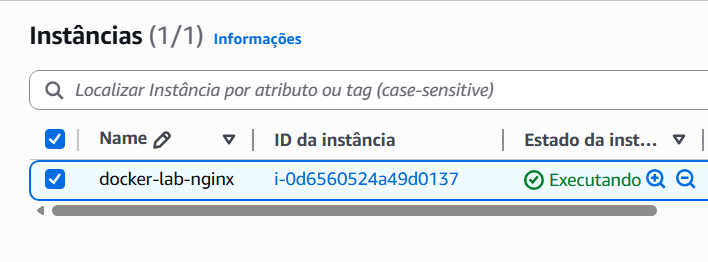
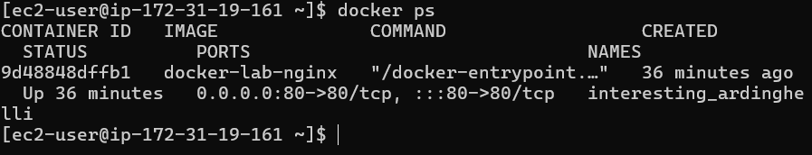
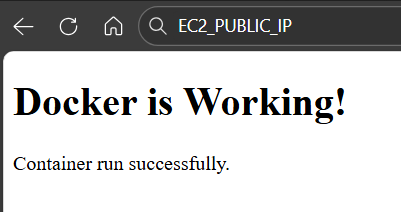

### 🇺🇸 EN-US

🐳 Docker – Practical Lab

📌 Description

This lab aims to demonstrate the basic use of Docker, covering fundamental concepts such as:

Images

Containers

Dockerfile

Running applications in an isolated environment

The lab was executed using AWS Cloud (Amazon EC2 – Free Tier), simulating a real-world cloud working environment.

🎯 Lab Objectives

Understand what Docker is and what it is used for

Create a Docker image from a Dockerfile

Run a container based on this image

Expose a simple application through an HTTP port

🛠️ Technologies Used

Docker

Linux

Nginx (official image)

AWS Cloud (Amazon EC2)

📂 Directory Structure
 docker/
├── Dockerfile
├── README.md
├── index.html
└── images/
    ├── ec2-running.png
    ├── docker-ps.png
    └── app-running.png

📄 Dockerfile

The Dockerfile defines the creation of a simple Docker image based on Nginx, used to serve a basic web page.

Dockerfile Example:

FROM nginx:latest

COPY index.html /usr/share/nginx/html/index.html

EXPOSE 80

📌 Explanation:

FROM nginx:latest → uses the official Nginx image

COPY → copies the HTML file into the container

EXPOSE 80 → exposes the default Nginx port

▶️ How to Run the Lab
1️⃣ Build the image
docker build -t docker-lab-nginx .

2️⃣ Run the container
docker run -d -p 80:80 docker-lab-nginx

3️⃣ Access the application

Open your browser and go to:

http://EC2_PUBLIC_IP

(On AWS Cloud, access is provided through the EC2 public IP.)

🧪 Platform Used

AWS Cloud (Amazon EC2 – Free Tier)

Real Linux environment in the cloud

Docker containers running on a virtual machine

Ideal for real-world Cloud and DevOps practice

🔄 Container Auto-Restart & Monitoring (Cron + Shell Script)

To simulate a production-like environment, an automated monitoring mechanism was implemented to ensure container availability.

A Bash script periodically checks:
- If the Docker service is running
- If the Nginx container is active

If Docker is stopped, the service is started automatically.
If the container is not running, it is restarted.

The script is executed via cron and generates logs for observability and troubleshooting.

✔️ This approach improves reliability and reduces downtime, simulating real-world Cloud and DevOps operational practices.

🧠 Key Learnings

Difference between image and container

How to create custom Docker images

How to map ports between host and container

Importance of Dockerfile for environment standardization

Basic deployment of containerized applications on AWS

🖼️ Deployment Evidence

The images below show the application running on an AWS EC2 instance, including the instance status, Docker container execution, and the application exposed via public IP.

📌 Possible Improvements

Create a multi-stage image

Use environment variables

Integrate with Docker Compose

Automate build and deployment with CI/CD

Evolve toward Kubernetes

✅ Conclusion

This lab demonstrates practical Docker knowledge applied in a Cloud Computing environment using AWS, serving as a foundation for DevOps, Infrastructure, and Kubernetes workflows.

👤 Author

Cainã Pereira

### 🇧🇷 PT-BR

🐳 Docker – Laboratório Prático

📌 Descrição

Este laboratório tem como objetivo demonstrar o uso básico do Docker, abordando conceitos fundamentais como:

Imagens

Containers

Dockerfile

Execução de aplicações em ambiente isolado

O laboratório foi executado utilizando a AWS Cloud (Amazon EC2 – Free Tier), simulando um ambiente real de trabalho em nuvem.

🎯 Objetivos do laboratório

Entender o que é Docker e para que serve

Criar uma imagem Docker a partir de um Dockerfile

Executar um container baseado nessa imagem

Expor uma aplicação simples via porta HTTP

🛠️ Tecnologias utilizadas

Docker

Linux

Nginx (imagem oficial)

AWS Cloud (Amazon EC2)

📂 Estrutura do diretório
docker/
├── Dockerfile
├── README.md
└── index.html

📄 Dockerfile

O Dockerfile define a criação de uma imagem Docker simples baseada no Nginx, utilizada para servir uma página web básica.

Exemplo de Dockerfile:

FROM nginx:latest

COPY index.html /usr/share/nginx/html/index.html

EXPOSE 80

📌 Explicação:

FROM nginx:latest → utiliza a imagem oficial do Nginx

COPY → copia o arquivo HTML para o container

EXPOSE 80 → expõe a porta padrão do Nginx

▶️ Como executar o laboratório
1️⃣ Build da imagem
docker build -t docker-lab-nginx .

2️⃣ Executar o container
docker run -d -p 80:80 docker-lab-nginx

3️⃣ Acessar a aplicação

Abra o navegador e acesse:

http://IP_PUBLICO_DA_EC2

(Na AWS Cloud, o acesso é feito através do IP público da instância EC2.)

🧪 Plataforma utilizada

AWS Cloud (Amazon EC2 – Free Tier)

Ambiente Linux real em nuvem

Execução de containers Docker em máquina virtual

Ideal para simular cenários reais de Cloud e DevOps

🔄 Monitoramento e Auto-Restart do Container (Cron + Shell Script)

Para simular um ambiente mais próximo de produção, foi implementado um mecanismo automatizado de monitoramento para garantir a disponibilidade do container.

Um script em Bash verifica periodicamente:
- Se o serviço Docker está em execução
- Se o container Nginx está ativo

Caso o Docker esteja parado, o serviço é iniciado automaticamente.
Caso o container não esteja rodando, ele é reiniciado.

O script é executado via cron e gera logs para observabilidade e troubleshooting.

✔️ Essa abordagem aumenta a confiabilidade do ambiente e reduz downtime, simulando práticas reais de Cloud e DevOps.

🧠 Aprendizados obtidos

Diferença entre imagem e container

Criação de imagens Docker customizadas

Mapeamento de portas entre host e container

Uso do Dockerfile para padronização de ambientes

Deploy básico de aplicações containerizadas na AWS

🖼️ Evidências do Deploy

As imagens abaixo demonstram a aplicação em execução em uma instância AWS EC2, incluindo o status da instância, a execução do container Docker e o acesso à aplicação via IP público.

📌 Possíveis melhorias

Criar uma imagem multi-stage

Utilizar variáveis de ambiente

Integrar com Docker Compose

Automatizar build e deploy com CI/CD

Evoluir para Kubernetes

✅ Conclusão

Este laboratório demonstra conhecimentos práticos de Docker aplicados em ambiente de Cloud Computing, utilizando a AWS, servindo como base para estudos e implementações em DevOps, Infraestrutura e Kubernetes.

👤 Autor

Cainã Pereira